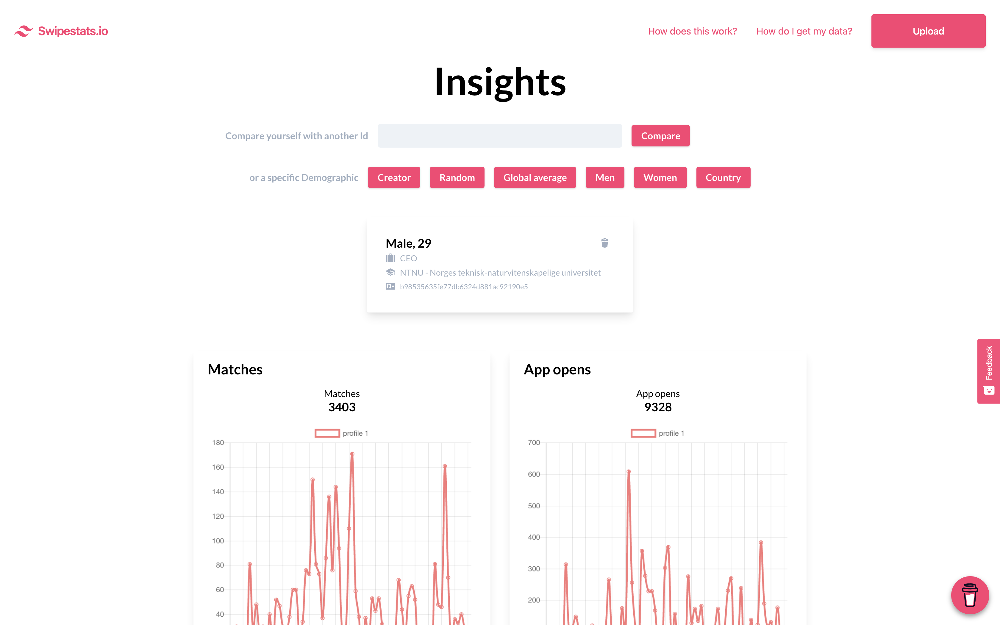

# Swipestats.io

> Visualize your dating data

## How to use

1. Get your data from Tinder from this [link](https://account.gotinder.com/data)
2. Parse the the data.json file in [swipestats.io](https://swipestats.io)
3. Upload the anonymized version
4. View insights and graphs

## Privacy

Swipestats generates a unique id for you by hashing your email and account creation date with the SHA256 algorithm. This way the email, or any other personal information, never reaches the server and total privacy is maintained.

```ts
export async function createSHA256Hash(str: string) {
  const utf8 = new TextEncoder().encode(str);
  const hashBuffer = await crypto.subtle.digest('SHA-256', utf8);
  const hashArray = Array.from(new Uint8Array(hashBuffer));
  const hashHex = hashArray.map((bytes) => bytes.toString(16).padStart(2, '0')).join('');
  return hashHex;
}
```

Which is then used to create a profile id. Should you upload your file again in the future your data will simply be overwritten without adding extra data to the corpus.

```ts
const profileId = await createSHA256Hash(birthDate + '-' + appProfileCreateDate);
```

[SHA256 Wikipedia](https://en.wikipedia.org/wiki/SHA-2)

## Demo

<!--  -->


